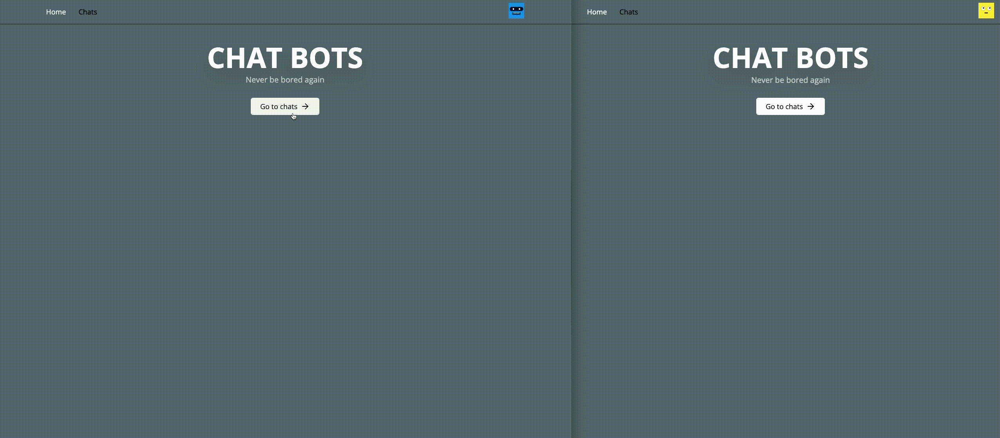

# Chat App

Real-time web-based chat platform.

## Tech Stack

### Frontend

- React
- Tailwind
- React Query
- Zustand
- React Router Dom
- React Hook Form

### Backend

- Express
- Prisma
- Socket.io

## Run Locally

1. Make sure to set up .env files in `apps/backend` and `apps/frontend` folders following `.env.example` files.
2. Run the following command `npm run make-all-work`.
